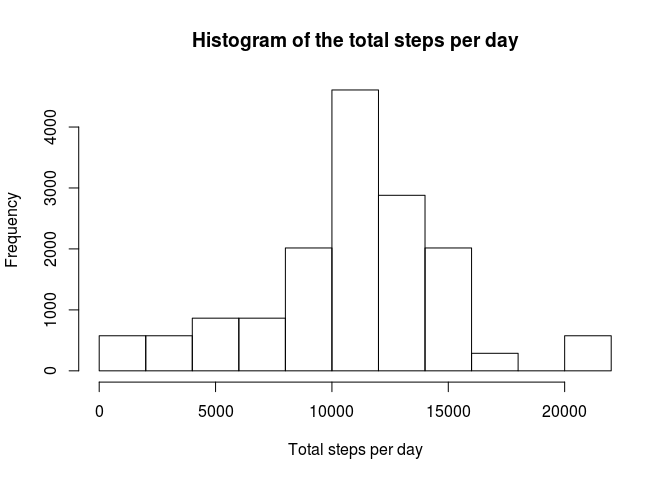
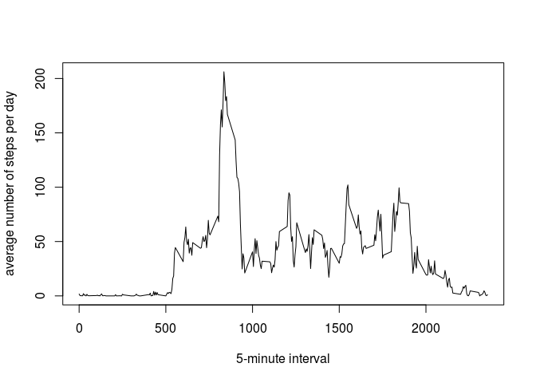
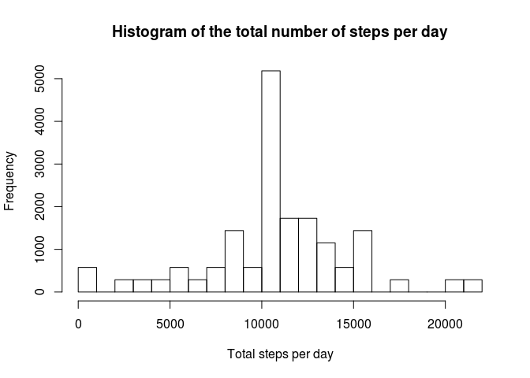
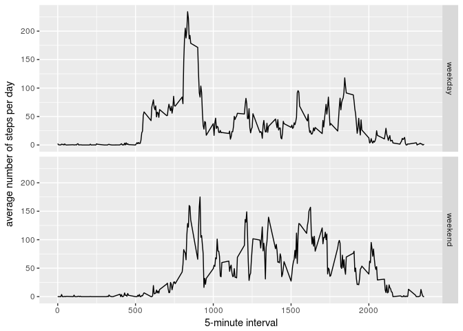

## Loading and preprocessing the data

```r
library(dplyr,warn.conflicts = FALSE)
library(ggplot2)

ac<-read.csv("activity.csv", stringsAsFactors=FALSE)
```

## What is mean total number of steps taken per day?
1.Calculate the total number of steps taken per day.


```r
totalStepsPerDay<-ac %>%
  group_by(date) %>% 
  mutate(totalSteps=sum(steps))
```

2.Make a histogram of the total number of steps taken each day.


```r
hist(totalStepsPerDay$totalSteps, xlab="Total steps per day", main="Histogram of the total steps per day")
```

<!-- -->

3.Calculate and report the mean and median of the total number of steps taken per day.


```r
summary(totalStepsPerDay$totalSteps)
```

```
##    Min. 1st Qu.  Median    Mean 3rd Qu.    Max.    NA's 
##      41    8841   10765   10766   13294   21194    2304
```

## What is the average daily activity pattern?
1.Make a time series plot (i.e. type = "l") of the 5-minute interval (x-axis) and the average number of steps taken, averaged across all days (y-axis)


```r
avgStepsPerInterval<-ac %>% 
  filter(!is.na(steps)) %>%
  group_by(interval) %>%
  mutate(avgStepsInterval=mean(steps)) %>%
  filter (! duplicated(interval)) %>%
  select(interval,avgStepsInterval)

plot(avgStepsPerInterval$interval, avgStepsPerInterval$avgStepsInterval,type="l", xlab="5-minute interval", ylab="average number of steps per day")
```

<!-- -->

2.Which 5-minute interval, on average across all the days in the dataset, contains the maximum number of steps?


```r
avgStepsPerInterval$interval[which.max(avgStepsPerInterval$avgStepsInterval)]
```

```
## [1] 835
```


## Imputing missing values
1.Calculate and report the total number of missing values in the dataset (i.e. the total number of rows with NAs)


```r
missings<-ac[ac$steps == "NA","steps"]
length(missings)
```

```
## [1] 2304
```

2.Devise a strategy for filling in all of the missing values in the dataset. The strategy does not need to be sophisticated. For example, you could use the mean/median for that day, or the mean for that 5-minute interval, etc.

The values of average steps per 5-minute interval are used to fill in the NA entries.

3.Create a new dataset that is equal to the original dataset but with the missing data filled in.


```r
acFilled <- ac
for (i in 1:length(acFilled$steps)) {
  if (is.na(acFilled$steps[i])) {
    interval = acFilled$interval[i]
    row <- which(avgStepsPerInterval$interval == interval)
    avgSteps <- avgStepsPerInterval[[row,2]]
    acFilled$steps[i] = avgSteps
  }
}
```

4.Make a histogram of the total number of steps taken each day and Calculate and report the mean and median total number of steps taken per day. Do these values differ from the estimates from the first part of the assignment? What is the impact of imputing missing data on the estimates of the total daily number of steps?


```r
totalStepsPerDay2<-acFilled %>%
  group_by(date) %>% 
  mutate(totalSteps=sum(steps))

hist(totalStepsPerDay2$totalSteps, xlab="Total steps per day", main="Histogram of the total number of steps per day")
```

<!-- -->

```r
summary(totalStepsPerDay2$totalSteps)
```

```
##    Min. 1st Qu.  Median    Mean 3rd Qu.    Max. 
##      41    9819   10766   10766   12811   21194
```

The mean and median of the total number of steps taken per day are different from the first part of the assignment because the missing rows (NA in **steps** entries) are filled by the average number of steps per interval.

## Are there differences in activity patterns between weekdays and weekends?

Setting the system to return day of week in English.


```r
Sys.setlocale("LC_TIME", "C")
```

1.Create a new factor variable in the dataset with two levels – “weekday” and “weekend” indicating whether a given date is a weekday or weekend day.


```r
ac<-ac %>% group_by(date) %>% mutate(dayOfWeek = ifelse(weekdays(as.Date(date, "%Y-%m-%d")) %in% c("Saturday","Sunday"), "weekend", "weekday"))
```

2.Make a panel plot containing a time series plot (i.e. type = "l") of the 5-minute interval (x-axis) and the average number of steps taken, averaged across all weekday days or weekend days (y-axis). See the README file in the GitHub repository to see an example of what this plot should look like using simulated data.


```r
avgStepsPerInterval2<-ac %>% 
  filter(!is.na(steps)) %>%
  group_by(dayOfWeek,interval) %>%
  mutate(avgStepsInterval=mean(steps)) %>%
  filter (! duplicated(interval)) %>%
  select(interval,avgStepsInterval,dayOfWeek)

g<-ggplot(avgStepsPerInterval2,aes(x=interval,y=avgStepsInterval))
g<-g+geom_line()+facet_grid(dayOfWeek~.)+labs(x="5-minute interval",y="average number of steps per day")
print(g)
```

<!-- -->
